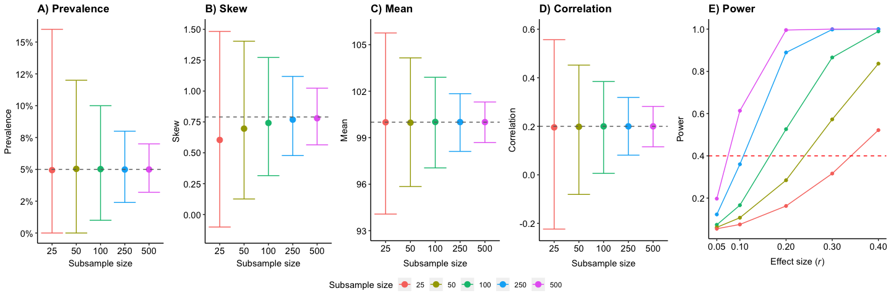

Script to estimate appropriate sample size for training datasets to trial analyses
================
Jessie Baldwin

<br>

### Overview

-   **Trialling analyses on a small subsample of data could introduce bias if associations can already be detected in the subsample**

-   **To avoid providing insight into the likely findings in the holdout dataset, the subsample needs to have low power, whilst being large enough to inform best practice for data analysis.**

-   **This R script uses simulation to identify an appropriate sample size for a subsample of data to trial analyses.**

-   **To do so, we will simulate a large dataset (N=10,000) and then randomly sample subsamples of different sizes (N=500, N=250, N=100, N=50, and N=25) from the original dataset.**

-   **We will then assess whether different sized subsamples (1) accurately represent the original sample distribution (to allow model assumptions to be tested), and (2) provide sufficiently low power to prevent insight into the overall findings.**

### Load libraries

We first load these packages in R:

``` r
library(MASS) # for simulating multivariate normal distributed variables
library(fGarch) # for simulating skewed variables
library(dplyr) # for data manipulation
library(psych) # for examining descriptives
library(ggplot2) # for producing plots
library(gridExtra) # for arranging plots
```

### Set seed for reproducibility

``` r
set.seed(666)
```

### Specify parameters for the simulation

We will simulate a dataset with N=10,000 rows and 5 continuous variables (with mean=0 and variance of 1), and we will specify correlations between the continuous variables ranging between 0.05 to 0.4. Later we will also add a binary and skewed variable. Note that this simulation was adapted from Prof. Dorothy Bishop's scripts which can be found at: <https://osf.io/gupxv/>.

``` r
mynSims <- 10000 # Number of simulations
N <- 10000 # Sample size for simulated dataset 
nVar <- 5 # Number of continuous variables 
mean <- 0 # Mean for continuous variables in the sample (we're using z scores)
var <- 1 # Variance of all continuous variables
cor <- c(1,     0.05,  0.1,  0.2,  0.3,
         0.05,  1,    0.4,  0.4,   0.4,
         0.1,   0.4,  1,    0.4,   0.4,
         0.2,   0.4,  0.4,  1,     0.4,
         0.3,   0.4,  0.4,  0.4,   1) # Correlations for all continuous variables (note: we specify correlations of 0.05, 0.1, 0.2, 0.3, and 0.4, while r=1 indicates the variance of an individual variable)
```

### Generate a correlation matrix for the simulated continuous variables

As shown in the correlation matrix, the correlations between variables (to be simulated) range from 0.05 to 0.4.

``` r
corMatrix <- matrix(cor, nrow=nVar, ncol=nVar) # Generate covariance matrix
corMatrix
```

    ##      [,1] [,2] [,3] [,4] [,5]
    ## [1,] 1.00 0.05  0.1  0.2  0.3
    ## [2,] 0.05 1.00  0.4  0.4  0.4
    ## [3,] 0.10 0.40  1.0  0.4  0.4
    ## [4,] 0.20 0.40  0.4  1.0  0.4
    ## [5,] 0.30 0.40  0.4  0.4  1.0

### Generate matrices to hold the simulation results in

Before simulating data, we will generate 2 matrices to hold 2 sets of results in:

##### Matrix 1 - to hold results showing how accurately the subsample represents the original data distribution

For this analysis we will test whether the prevalence, skewness, and mean value of the subsamples (N=25, N=50, N=100, N=250 and N=500) will accurately reflect the corresponding values in the original dataset. The labels of the matrix identify each parameter and sample size (e.g. "prev\_500" will show the prevalence with a subsample of N=500).

``` r
distributionMatrix <- matrix(rep(NA,(mynSims*21)),nrow=mynSims) 
colnames(distributionMatrix) <- c("run", 
                      "prev_500", "prev_250", "prev_100", "prev_50", "prev_25", 
                      "skew_500", "skew_250", "skew_100", "skew_50", "skew_25", 
                      "mean_500", "mean_250", "mean_100", "mean_50", "mean_25",
                      "cor_500", "cor_250", "cor_100", "cor_50", "cor_25") # Label column names
head(distributionMatrix, n=2)
```

    ##      run prev_500 prev_250 prev_100 prev_50 prev_25 skew_500 skew_250 skew_100
    ## [1,]  NA       NA       NA       NA      NA      NA       NA       NA       NA
    ## [2,]  NA       NA       NA       NA      NA      NA       NA       NA       NA
    ##      skew_50 skew_25 mean_500 mean_250 mean_100 mean_50 mean_25 cor_500 cor_250
    ## [1,]      NA      NA       NA       NA       NA      NA      NA      NA      NA
    ## [2,]      NA      NA       NA       NA       NA      NA      NA      NA      NA
    ##      cor_100 cor_50 cor_25
    ## [1,]      NA     NA     NA
    ## [2,]      NA     NA     NA

##### Matrix 2 - to hold results showing the statistical power of the subsample in detecting an association between 2 variables

Here we will test the statistical power of each subsample (N=25, N=50, N=100, N=250 and N=500) in detecting a statistically significant association (p&lt;0.05) in a linear regression across 5 effect sizes (r=0.05, 0.1, 0.2, 0.3, and 0.4). The labels of the matrix identify each effect size and sample size (e.g. "0.05\_500" will show the result of the association for r=0.05 with a subsample of N=500).

``` r
powerMatrix <- matrix(rep(NA,(mynSims*26)),nrow=mynSims) 
colnames(powerMatrix) <- c("run", 
                           "0.05_500", "0.1_500", "0.2_500", "0.3_500", "0.4_500", 
                           "0.05_250", "0.1_250", "0.2_250", "0.3_250", "0.4_250", 
                           "0.05_100", "0.1_100", "0.2_100", "0.3_100", "0.4_100", 
                           "0.05_50", "0.1_50", "0.2_50", "0.3_50", "0.4_50",
                           "0.05_25", "0.1_25", "0.2_25", "0.3_25", "0.4_25") 
head(powerMatrix, n=2)
```

    ##      run 0.05_500 0.1_500 0.2_500 0.3_500 0.4_500 0.05_250 0.1_250 0.2_250
    ## [1,]  NA       NA      NA      NA      NA      NA       NA      NA      NA
    ## [2,]  NA       NA      NA      NA      NA      NA       NA      NA      NA
    ##      0.3_250 0.4_250 0.05_100 0.1_100 0.2_100 0.3_100 0.4_100 0.05_50 0.1_50
    ## [1,]      NA      NA       NA      NA      NA      NA      NA      NA     NA
    ## [2,]      NA      NA       NA      NA      NA      NA      NA      NA     NA
    ##      0.2_50 0.3_50 0.4_50 0.05_25 0.1_25 0.2_25 0.3_25 0.4_25
    ## [1,]     NA     NA     NA      NA     NA     NA     NA     NA
    ## [2,]     NA     NA     NA      NA     NA     NA     NA     NA

### Define functions for analyses on simulated dataset

We will now define functions needed in the simulation. The first one is to obtain the prevalence of a binary variable (called V\_binary), which we will generate in the simulation.

``` r
prev_bin <- function(data) {
  prop <- prop.table(table(factor(data$V_binary, levels=0:1)))[2]
  return(prop)
}
```

The next is to assess the skew of a variable (called V\_skew), which we will generate in the simulation.

``` r
skew <- function(data) {
  skewness <- describe(data$V_skew)$skew
  return(skewness)
}
```

The next is to assess the mean of a variable (called V\_norm), which we will generate in the simulation.

``` r
mean_value <- function(data) {
  mean_score <- describe(data$V_norm)$mean
  return(mean_score)
}
```

The next is to assess the correlation between two variables, which we will generate in the simulation.

``` r
cor_value <- function(data) {
  cor <- cor(data$V1, data$V4)
  return(cor)
}
```

Finally we derive a function to conduct regressions and extract p-values (needed for the power analysis) for associations with different effect sizes. We know the combinations of variables that will have certain associations because we specified the correlation matrix between these variables already. For example, variables 1 and 2 (V1 & V2) are correlated r = 0.05.

``` r
reg <- function(data) {
  r_0.05 <- summary(lm(V2 ~ V1, data))$coefficients[2,4]
  r_0.1 <- summary(lm(V3 ~ V1, data))$coefficients[2,4]
  r_0.2 <- summary(lm(V4 ~ V1, data))$coefficients[2,4]
  r_0.3 <- summary(lm(V5 ~ V1, data))$coefficients[2,4]
  r_0.4 <- summary(lm(V2 ~ V3, data))$coefficients[2,4]
  return(c(r_0.05, r_0.1, r_0.2, r_0.3, r_0.4))
}
```

### Conduct simulation

``` r
for (i in 1:mynSims) { 
  
  ### Simulate continuous variables with pre-specified correlations
  cont_data <- as.data.frame(mvrnorm(n=N, rep(mean, nVar), corMatrix))

  ### Simulate data for a binary outcome with low prevance (5%)
  V_binary = rbinom(n=N, size=1, prob=0.05)      
  
  ### Simulate skewed continuous variable 
  V_skew <- rsnorm(N, mean = 100, sd = 15, xi = 2)
  
  ### Simulate normal continuous variable with mean of 100, and SD of 15
  V_norm <- rnorm(N, mean = 100, sd = 15)
  
  ### Combine all variables into one dataframe
  sim_data <- data.frame(cbind(cont_data, V_binary, V_skew, V_norm))

  ### Derive random subsamples from this simulated dataset
  sample_500 <- sim_data[sample(nrow(sim_data), 500), ] # Sample of N=500
  sample_250 <- sim_data[sample(nrow(sim_data), 250), ] # Sample of N=250
  sample_100 <- sim_data[sample(nrow(sim_data), 100), ] # Sample of N=100
  sample_50 <- sim_data[sample(nrow(sim_data), 50), ] # Sample of N=50
  sample_25 <- sim_data[sample(nrow(sim_data), 25), ] # Sample of N=25
  
  ### Combine samples into a list
  samples <- list(sample_500, sample_250, sample_100, sample_50, sample_25)
  
  ### Extract data on distribution of each sample and store it in the matrix
  distributionMatrix[i,1] <- i # stores the 'run' (i.e., the simulated dataset)
  distributionMatrix[i,2:6] <- sapply(samples, prev_bin) # Extract the prevalence
  distributionMatrix[i,7:11] <- sapply(samples, skew) # Extract the skew
  distributionMatrix[i,12:16] <- sapply(samples, mean_value) # Extract the mean
  distributionMatrix[i,17:21] <- sapply(samples, cor_value) # Extract the correlation between variables V1 and V4
  
  ### Extract p-values for the regressions between vars with different effect sizes and store in matrix
  powerMatrix[i, 1] <- i # stores the 'run' (i.e., the simulated dataset)
  powerMatrix[i, 2:26] <- as.vector(sapply(samples, reg)) # Extract the p-values
}
```

### View matrix of results on distribution of the subsamples

``` r
distr_table <- data.frame(distributionMatrix)
head(distr_table, n=2)
```

    ##   run prev_500 prev_250 prev_100 prev_50 prev_25  skew_500  skew_250  skew_100
    ## 1   1    0.050    0.048     0.05    0.08    0.16 0.8731665 0.8561505 0.5965659
    ## 2   2    0.054    0.052     0.02    0.00    0.00 0.9833060 1.0949067 0.3884532
    ##     skew_50   skew_25 mean_500 mean_250  mean_100  mean_50   mean_25   cor_500
    ## 1 0.4801032 0.7410967 99.07284 99.26158 101.60086 101.8985 106.22692 0.1886030
    ## 2 0.2304207 0.7401767 99.48393 98.80950  98.35042 102.8651  99.03941 0.1755374
    ##     cor_250    cor_100     cor_50     cor_25
    ## 1 0.1549519 0.08493137 0.09514764 0.06483848
    ## 2 0.1232160 0.26648470 0.21885069 0.39216225

### Assess whether subsamples accurately represent the distribution of the original sample

We will now assess whether variables in the subsamples have a similar prevalence, skewness, mean and correlations as in the original dataset, across 10,000 simulations.

To do so we will extract the average prevalence, skewness, mean and correlation between two variables in the subsamples, as well as the interquartile range.

``` r
means <- apply(distr_table[,-1], 2, mean)
low_CI <- apply(distr_table[,-1], 2, quantile, probs=0.025, na.rm=TRUE)
up_CI <- apply(distr_table[,-1], 2, quantile, probs=0.975, na.rm=TRUE)
```

#### Prepare data to plot the proportion accurate (for prevalence, skew, and mean) across all subsamples

``` r
sample_size <- c(500, 250, 100, 50, 25)
outcome <- c(rep("prev", 5), rep("skew",5), rep("mean",5), rep("cor",5))
d_data <- data.frame(outcome, sample_size, means, low_CI, up_CI)
d_data$sample_size <- factor(d_data$sample_size, levels = c("25", "50", "100",  "250", "500"))
```

##### Plot prevalence across all subsamples

``` r
A <- ggplot(subset(d_data, outcome=="prev"), aes(x=sample_size, y=means, colour=factor(sample_size))) + 
  geom_errorbar(aes(ymin=low_CI, ymax=up_CI), position = position_dodge(width=0.4)) +
  geom_point(size=3, position=position_dodge2(width=0.4)) +
  scale_y_continuous(name="Prevalence", labels = scales::percent_format(accuracy = 1L), 
                     breaks=c(0, 0.025, 0.05, 0.075, 0.1, 0.125, 0.15)) + 
  scale_x_discrete(name="Subsample size") +
  scale_color_discrete("Subsample size")+
  ggtitle("A) Prevalence") +
  theme(panel.border = element_blank(), panel.grid.major = element_blank(), 
        panel.grid.minor = element_blank(),
        panel.background = element_blank(),    
        plot.title = element_text(face = "bold"), 
        axis.line = element_line(colour = "black"),
        axis.text = element_text(size=11, colour="black"),                      
        axis.title.x = element_text(size=11, margin = margin (t=5, r=0, b=0, l=0)),
        legend.position="none")+
  geom_hline(yintercept=0.05, linetype="dashed", color = "dimgrey")
```

##### Plot skewness across all subsamples

``` r
B <- ggplot(subset(d_data, outcome=="skew"), aes(x=sample_size, y=means, colour=factor(sample_size))) + 
  geom_errorbar(aes(ymin=low_CI, ymax=up_CI), position = position_dodge(width=0.4)) +
  geom_point(size=3, position=position_dodge2(width=0.4)) +
  scale_y_continuous(name="Skew", limits=c(-0.15,1.5), breaks=c(0, 0.25, 0.5, 0.75, 1, 1.25, 1.5)) + 
  scale_x_discrete(name="Subsample size") +
  scale_color_discrete("Subsample size")+
  ggtitle("B) Skew") +
  theme(panel.border = element_blank(), panel.grid.major = element_blank(), 
        panel.grid.minor = element_blank(),
        panel.background = element_blank(),
        plot.title = element_text(face = "bold"), 
        axis.line = element_line(colour = "black"),
        axis.text = element_text(size=11, colour="black"),          
        axis.title.x = element_text(size=11, margin = margin (t=5, r=0, b=0, l=0)),
        legend.position="none")+
  geom_hline(yintercept=0.79, linetype="dashed", color = "dimgrey")
```

##### Plot mean across all subsamples

``` r
C <- ggplot(subset(d_data, outcome=="mean"), aes(x=sample_size, y=means, colour=factor(sample_size))) + 
  geom_errorbar(aes(ymin=low_CI, ymax=up_CI), position = position_dodge(width=0.4)) +
  geom_point(size=3, position=position_dodge2(width=0.4)) +
  scale_y_continuous(name="Mean", limits=c(93, 106), breaks=c(93, 96, 99, 102, 105)) + 
  scale_x_discrete(name="Subsample size") +
  scale_color_discrete("Subsample size")+
  ggtitle("C) Mean") +
  theme(panel.border = element_blank(), panel.grid.major = element_blank(), 
        panel.grid.minor = element_blank(),
        panel.background = element_blank(),
        plot.title = element_text(face = "bold"), 
        axis.line = element_line(colour = "black"),
        axis.text = element_text(size=11, colour="black"),   
        axis.title.x = element_text(size=11, margin = margin (t=8, r=0, b=0, l=0)),
        legend.position="none")+
  geom_hline(yintercept=100, linetype="dashed", color = "dimgrey")
```

##### Plot correlation across all subsamples

``` r
D <- ggplot(subset(d_data, outcome=="cor"), aes(x=sample_size, y=means, colour=factor(sample_size))) + 
  geom_errorbar(aes(ymin=low_CI, ymax=up_CI), position = position_dodge(width=0.4)) +
  geom_point(size=3, position=position_dodge2(width=0.4)) +
  scale_y_continuous(name="Correlation", limits=c(-0.23, 0.6), breaks=c(-0.2, 0, 0.2, 0.4, 0.6)) + 
  scale_x_discrete(name="Subsample size") +
  scale_color_discrete("Subsample size")+
  ggtitle("D) Correlation") +
  theme(panel.border = element_blank(), panel.grid.major = element_blank(), 
        panel.grid.minor = element_blank(),
        panel.background = element_blank(),
        plot.title = element_text(face = "bold"), 
        axis.line = element_line(colour = "black"),
        axis.text = element_text(size=11, colour="black"),   
        axis.title.x = element_text(size=11, margin = margin (t=8, r=0, b=0, l=0)),
        legend.position="none")+
  geom_hline(yintercept=0.2, linetype="dashed", color = "dimgrey")
```

### Assess power of the subsamples to detect a statistically significant association between variables with different effect sizes

#### View matrix of results on distribution of the subsamples

``` r
power_table <- data.frame(powerMatrix)
head(power_table, n=2)
```

    ##   run X0.05_500   X0.1_500     X0.2_500     X0.3_500     X0.4_500 X0.05_250
    ## 1   1 0.3321966 0.01081462 2.186993e-05 1.137205e-09 7.685003e-25 0.6814899
    ## 2   2 0.1358536 0.25078755 7.947011e-05 3.353010e-09 5.077746e-28 0.7131251
    ##    X0.1_250   X0.2_250     X0.3_250     X0.4_250 X0.05_100  X0.1_100
    ## 1 0.6473847 0.01418448 3.277546e-07 7.636459e-10 0.5417201 0.6786399
    ## 2 0.2505966 0.05166983 1.200326e-05 5.239095e-15 0.3163551 0.1469794
    ##      X0.2_100    X0.3_100     X0.4_100  X0.05_50   X0.1_50   X0.2_50
    ## 1 0.400821384 0.001326439 2.073739e-05 0.3073048 0.2340039 0.5110059
    ## 2 0.007362472 0.001235223 9.729128e-04 0.4946185 0.2475226 0.1267749
    ##       X0.3_50      X0.4_50  X0.05_25     X0.1_25   X0.2_25    X0.3_25
    ## 1 0.721377278 0.0026912104 0.9048969 0.009198898 0.7581439 0.01299927
    ## 2 0.002994062 0.0006533555 0.7049827 0.911018500 0.0525132 0.10067636
    ##      X0.4_25
    ## 1 0.04019972
    ## 2 0.33339138

#### Define function to report proportion of times in which the p-value &lt; 0.05

``` r
p_val <- function(data) {
  prop <- mean(data < 0.05)
  return(prop)
}
```

#### Prepare data to plot the power across all subsamples

``` r
p <- sapply(power_table[,2:26], p_val)
sample_size <- c(rep(500,5), rep(250,5), rep(100,5), rep(50,5), rep(25,5))
es <- rep(c(0.05, 0.1, 0.2, 0.3, 0.4),5)
p_data <- data.frame(sample_size, es, p)
p_data$sample_size <- factor(p_data$sample_size, levels = c("25", "50", "100", "250", "500"))
```

#### Plot power across effect sizes and subsamples

``` r
E <- ggplot(p_data, aes(es, p, colour=factor(sample_size))) + 
  geom_point() + geom_line() +
  scale_y_continuous(name="Power", breaks=c(0, 0.2, 0.4, 0.6, 0.8, 1)) + 
  scale_x_continuous(breaks=c(0, 0.05, 0.1, 0.2, 0.3, 0.4)) +
  xlab(expression(paste("Effect size (", italic("r"), ")")))+
  scale_color_discrete("Subsample size")+
  ggtitle("E) Power") +
  theme(panel.border = element_blank(), panel.grid.major = element_blank(), 
        panel.grid.minor = element_blank(),
        panel.background = element_blank(),       
        plot.title = element_text(face = "bold"), 
        axis.line = element_line(colour = "black"),
        axis.text = element_text(size=11, colour="black"),                      
        axis.title.y = element_text(size=11, margin = margin (t=0, r=8, b=0, l=0)),
        axis.title.x = element_text(size=11, margin = margin (t=8, r=0, b=0, l=0)),
        legend.key = element_blank(),
        legend.title = element_text(size=11),
        legend.text = element_text(size=11))+
  geom_hline(yintercept=0.4, linetype="dashed", color = "red") # add line indicating 40% power
```

#### Combine plots to produce figure for Box 1

``` r
library(ggpubr)
```

    ## Loading required package: magrittr

``` r
plot <- ggarrange(A, B, C, D, E,  nrow=1, common.legend = TRUE, legend="bottom", hjust=c(-0.1,-0.1),
                  widths=c(1, 1, 1, 1, 1.3))
plot
```


